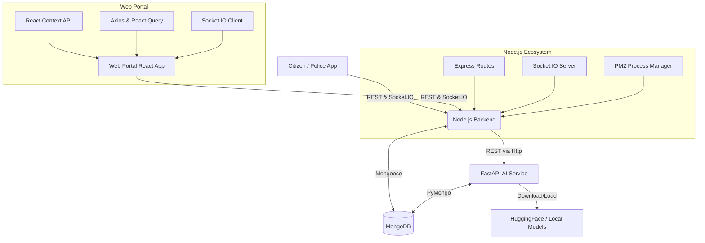

# Dial-112 System Architecture

## Overview
Dial-112 is a next-generation police emergency response system. It consists of three main components:
1. **Citizen Android App (React Native/Kotlin)**
2. **AI Microservice (FastAPI)**
3. **Police Control Room Web Portal & Backend (React, Node.js)**

## Component Diagram

## Production Deployment Structure
The entire suite is containerized with Docker and managed by `docker-compose`.

1. **MongoDB**: Persistence layer running `mongo:7.0`
2. **Node.js Backend**: Express server managed by `pm2` in cluster mode (`Dockerfile` in `backend/`)
3. **Web Portal**: React app built with Vite, served natively by NGINX (`Dockerfile` in `web_portal/frontend/`)
4. **AI Service**: Python FastAPI server managing DeepFace, YOLOv8, and complaint classification.

## Detailed Flow (SOS Dispatch)
1. **Trigger**: Android app emits `sos_alert` over Socket.IO (or HTTP POST).
2. **Backend**: Node.js receives SOS, stores in MongoDB, and broadcasts `sos_alert` to all `admin` and `control_room` clients connected.
3. **Web Portal**: Control Room operator receives instant audio and visual alert. Socket context captures alert and updates map.
4. **Dispatch**: Operator selects a nearby officer and hits "Dispatch". Portal calls `POST /portal/sos/:id/dispatch`.
5. **Assignment**: Backend updates database, and broadcasts `sos_dispatched` to the specific police officer's mobile app.

## AI Interactions
The Node.js backend operates as a proxy to the AI microservice. When the control room operator uploads an ANPR image or Face Recognition image, the portal calls `/api/ai/*` which the backend forwards to the Python service. Due to Python memory constraints (loading models), Python's `/health` runs slowly and therefore its healthchecks are extended.
